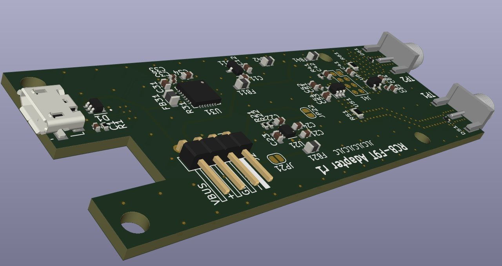
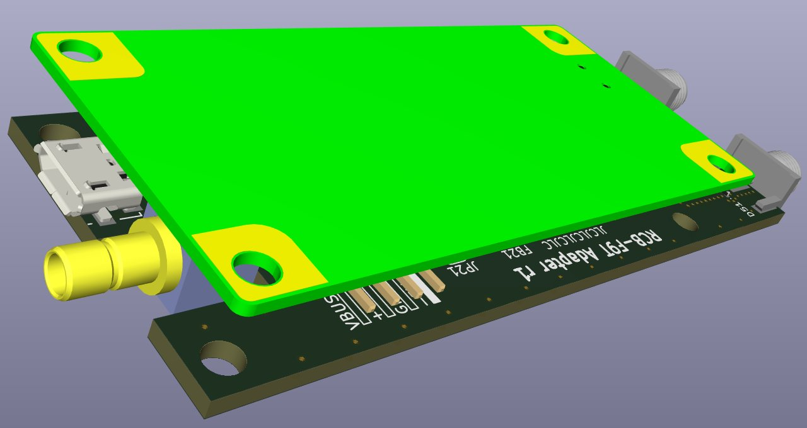
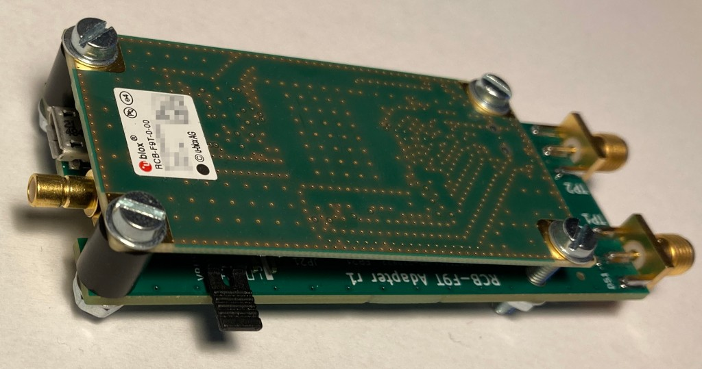

# u-blox RCB-F9T Adapter PCB w/ USB and SMA

Stackable adapter PCB for u-blox [RCB-F9T timing board](https://www.u-blox.com/en/product/rcb-f9t-timing-board) with the following features:

  * USB-to-UART converter (SiLabs CP2102)
  * fully USB-powered (option to supply RCB-F9T from low noise voltage source)
  * SMA connectors for TP1 and TP2 pins of RCB-F9T
  * SMA can drive 50 Ohm loads via buffer opamp (TI BUF602)

This repository contains KiCad EDA files of the PCB design and [JLCPCB fabrication files](./fabrication).

## Renderings of Adapter PCB with/without RCB-F9T

# Revisions

## Revision 1

Initial revision including JLCPCB fabrication files.

**Known Issues**:

  * RCB-F9T NRST pin is incorrectly treated as RST (pulled down via R41)
  * FB41 is too close to mounting hole

Board is fully operational after desoldering R41.

### Image of Adapter PCB with RCB-F9T

## Revision 2

Above issues fixed in EDA files (**not** fabrication files), but design was neither produced nor verified.
